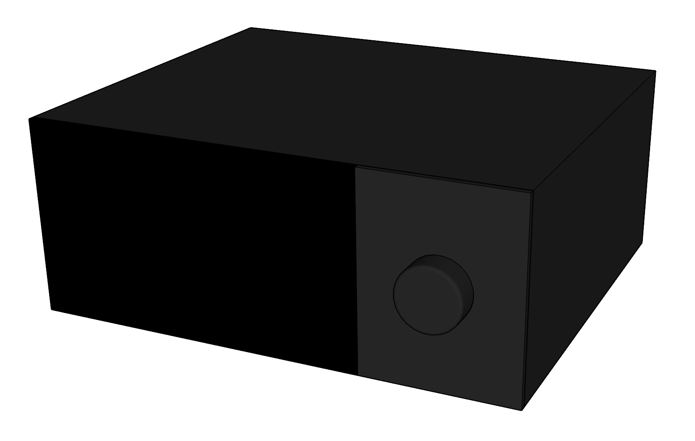
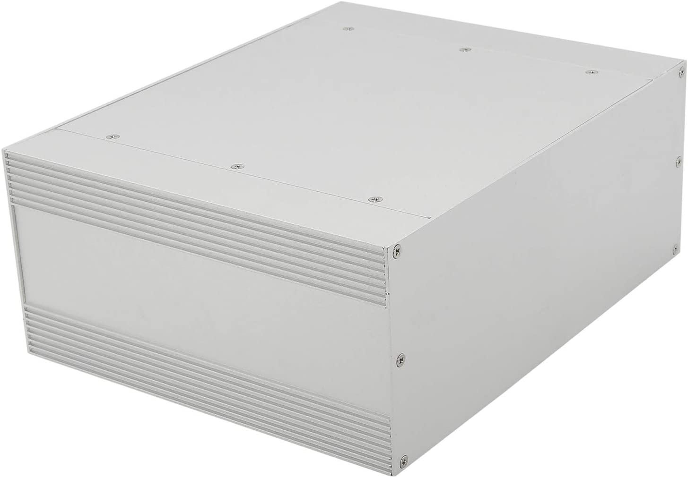
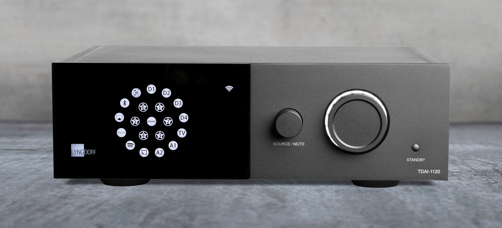
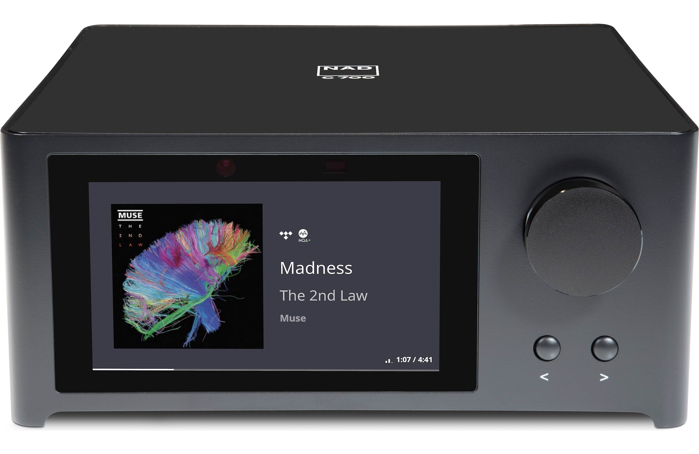

# ModulAmp - Enclosure

<figcaption>Artist representation of the final product</figcaption>

<figcaption>Bare enclosure</figcaption>

I have selected this [chassis](https://smile.amazon.com/gp/product/B07VRKD183) for the size of the front panel, because it is not completely offensive to the eye, and because it adheres to the [Kallax-Fi principles](https://darko.audio/2019/02/introducing-kallax-fi/). It should be completed by a couple of perspex parts and a big black knob on the front to give it a cool grey/black look. My guiding inspriation is something similar to the [Lyngdorf TDAI-1120](https://lyngdorf.steinwaylyngdorf.com/lyngdorf-tdai-1120/), or the [NAD Masters M10](https://nadelectronics.com/m10/) only without the price tag.

<figcaption>Lyngdorf TDAI-1120</figcaption>

<figcaption>NAD Masters M10</figcaption>

I am adding some [feet](https://smile.amazon.com/gp/product/B07QLZCX2F) to raise it and allow for some mounting screws to be installed from the bottom.

Rear panel connections include a [power receptacle with an on/off switch](https://smile.amazon.com/gp/product/B00ME5YAPK), two set of [speakers binding posts](https://smile.amazon.com/gp/product/B01LW4HVBU), and two sets of [RCA line inputs](https://smile.amazon.com/gp/product/B0002KR5MO).

