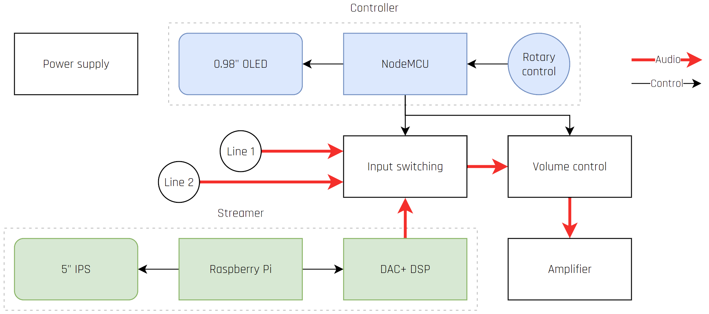
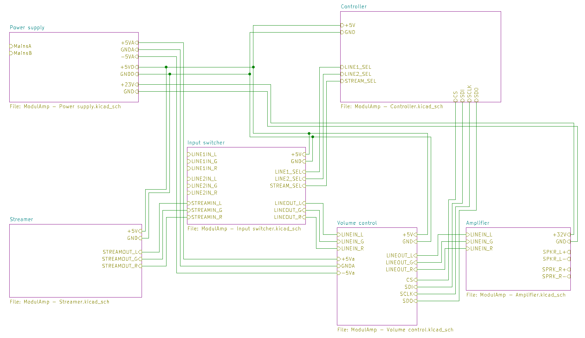
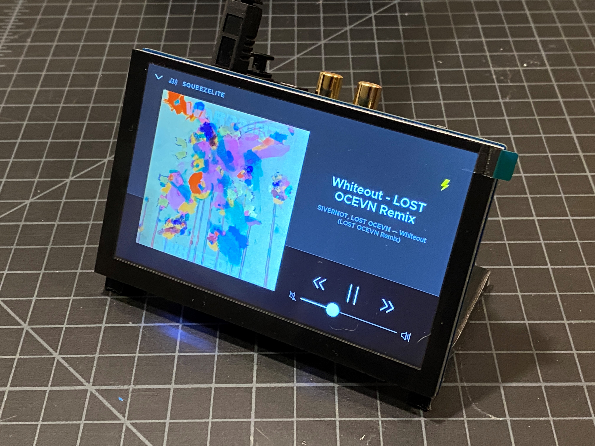
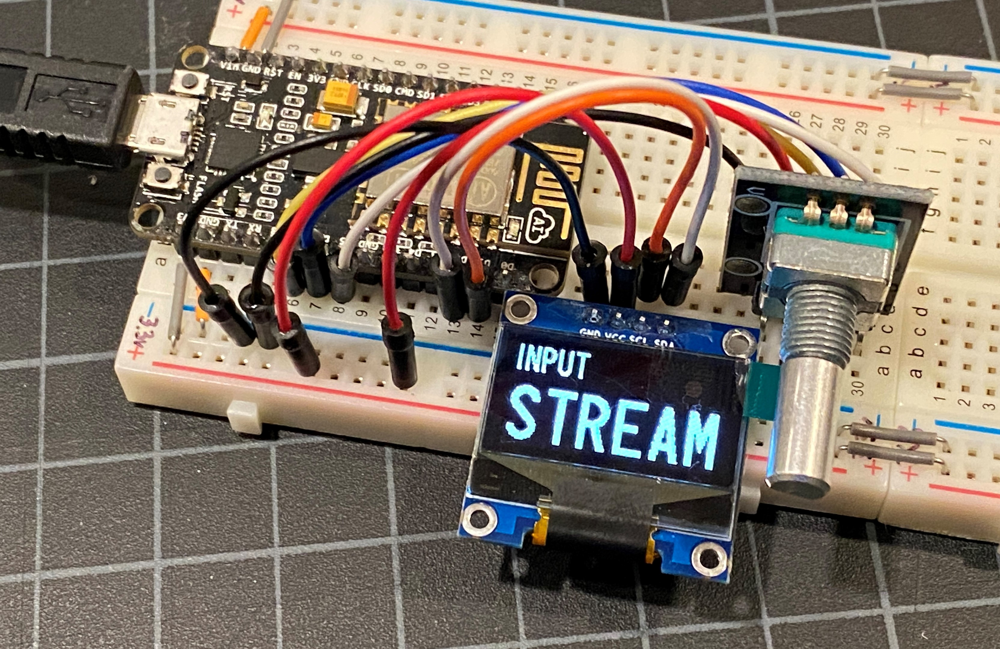
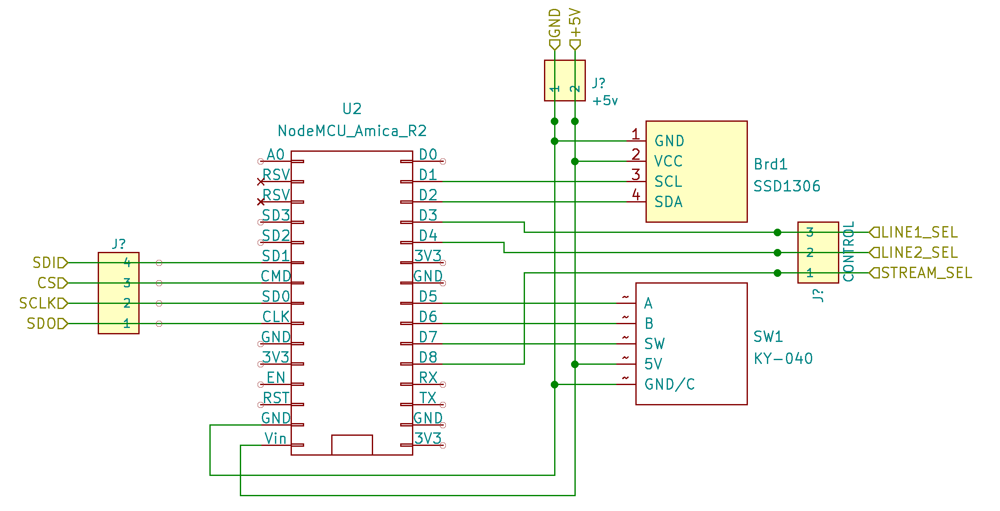
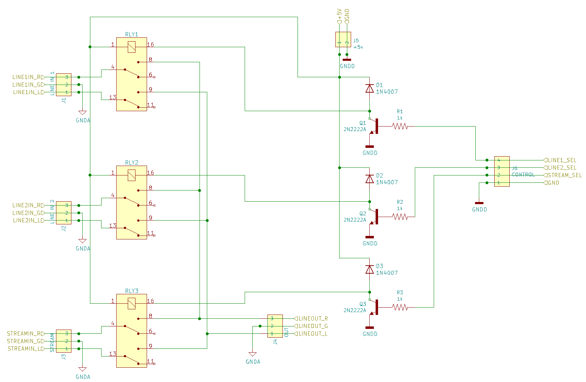
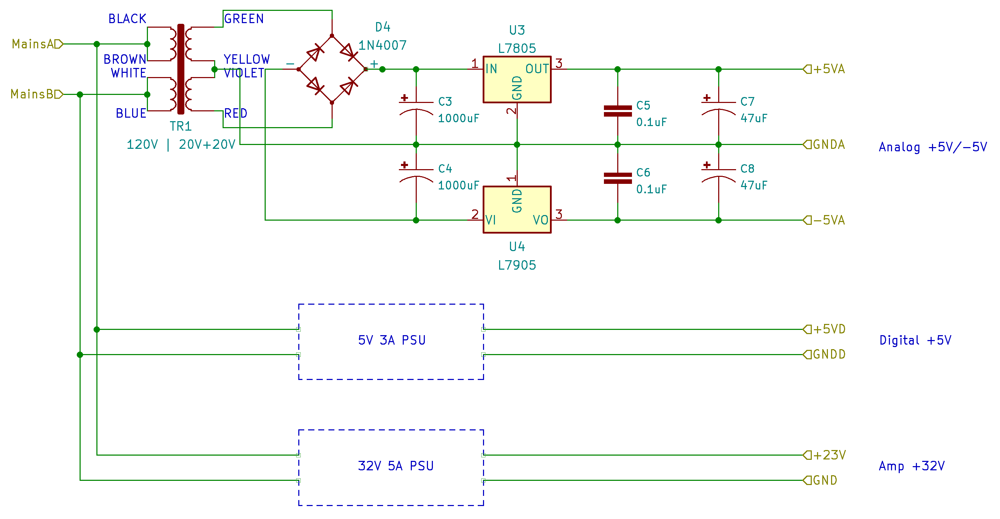

# ModulAmp - Hardware

new_releases (something about modularity)

<figcaption>ModulAmp hardware modules</figcaption>

<figcaption>Modules connections</figcaption>

### Streamer

The streaming module is implemented using a Raspberry Pi 3B+, an [HifiBerry DAC+ DSP](https://www.hifiberry.com/shop/boards/hifiberry-dac-dsp/), and a [5" screen](https://smile.amazon.com/gp/product/B095HQPY5X) to show the UI. The operating system is [HifiBerryOS](https://www.hifiberry.com/hifiberryos/), a Linux distribution developed by Modul 9 specifically for audio applications. Another option would be [piCorePlayer](https://docs.picoreplayer.org/getting-started/), but I have not verified this on my test system yet. Besides, HifiBerryOS natively supports the HifiBerry DAC+ DSP functionalities like Room Compensation, etc, and it looks swell.

<figcaption>Streaming module prototype</figcaption>

This solution can stream from a number of streaming services and also act as a player in the Logitech Music Server ecosystem (previously known as Squeezebox Server and SlimServer, now just LMS). While the actual Logitech products have long been discontinued, the server still lives, supported, as an [open source effort](https://wiki.slimdevices.com/index.php/Logitech_Media_Server.html) that can connect to even more streaming services and your local music library.

Right now, I am going to use my Windows server as the LMS, but considering that LMS can also run on a Raspberry Pi, it could be implemented on the streaming module itself or as a separate board inside ModulAmp. A small 2.5" portable HD should be enough to hold your FLAC and MP3 files, but at this point we are maybe hitting the space limits of the planned chassis (on the other hand a Rasperry Pi Zero W and a small USB drive could fit in quite comfortably).

### Controller

The controller module is build around a [NodeMCU dev kit](https://smile.amazon.com/AITRIP-NodeMcu-Internet-Development-Micropython/dp/B08B4P9LB7), using a [KY-040 rotary encoder](https://smile.amazon.com/gp/product/B06XQTHDRR) as its only input mechanism and driving a [0.98" OLED display](https://smile.amazon.com/gp/product/B07F3KY8NF) to show the UI. The separate screen, in addition to the streaming module one, is necessary in those scenarios where music is played from one of the two line in sources.

<figcaption>Controller module prototype</figcaption>

The firmware running on the controller is written in C++ and described in the [software section](software.html#controller).

<figcaption>Controller module schematics</figcaption>

new_releases TBW description of the module connections

### Input switching

The input switching module is based on a series of three [dual-throw 5V relays](https://smile.amazon.com/gp/product/B0874MC6D3) driven by a simple protection circuit wired to three GPIO pins from the controller. This module is pretty straightforward, but there is an effort to keep the analog and digital sides separated to minimize crosstalk and noise.

<figcaption>Input switching module schematic</figcaption>

### Volume control

With the plan to use a single rotary encoder for input selection and volume control, I had to figure out a way to actually control the volume of the signal going into the amplifier module. I wanted this to be fully digital on the control side and fully analog on the audio path side, and the [Texas Instruments PGA2311](https://www.ti.com/lit/ds/symlink/pga2311.pdf?ts=1640124937060&ref_url=https%253A%252F%252Fwww.ti.com%252Fproduct%252FPGA2311) seems to be the ticket.

new_releases (insert volume control schematics here)
<figcaption>Volume control schematics</figcaption>

This can be controlled via the SPI bus exposed by the controller module, see the software section for how it was done.

### Power supply

This module needs to provide at least three voltages: +5V for the streamer and controller modules, -5V for the volume control module, and some power for the amplifier. In this first iteration, using a Class T amplifier, we'll need just +12V.

<figcaption>Power supply schematics</figcaption>

The circuit is quite straightforward, using a LM7805 for the +5V rail, a LM7905 for the -5V rail, and a LM7812 for the +12 V. There's really not much to it, but in future revisions I might try to separate the rails that go to digital and analog modules, to separate the ground planes and minimize interference.

### Amplifier

For the first iteration of ModulAmp, I am going to use something that I have in my spare box as the final amplification stage: a [Sonic Impact T-Amp](https://www.tnt-audio.com/ampli/t-amp_e.html). This will be powered by the 12V rail (even if it can take 13.8V max) and let's see if it is sufficient for my studio. ModulAmp being _modular_, there's no reason why this stage cannot be replaced by a [Gainclone](https://en.wikipedia.org/wiki/Gainclone) or something like the [Aiyima A07](https://smile.amazon.com/dp/B08CJZGT6H).


