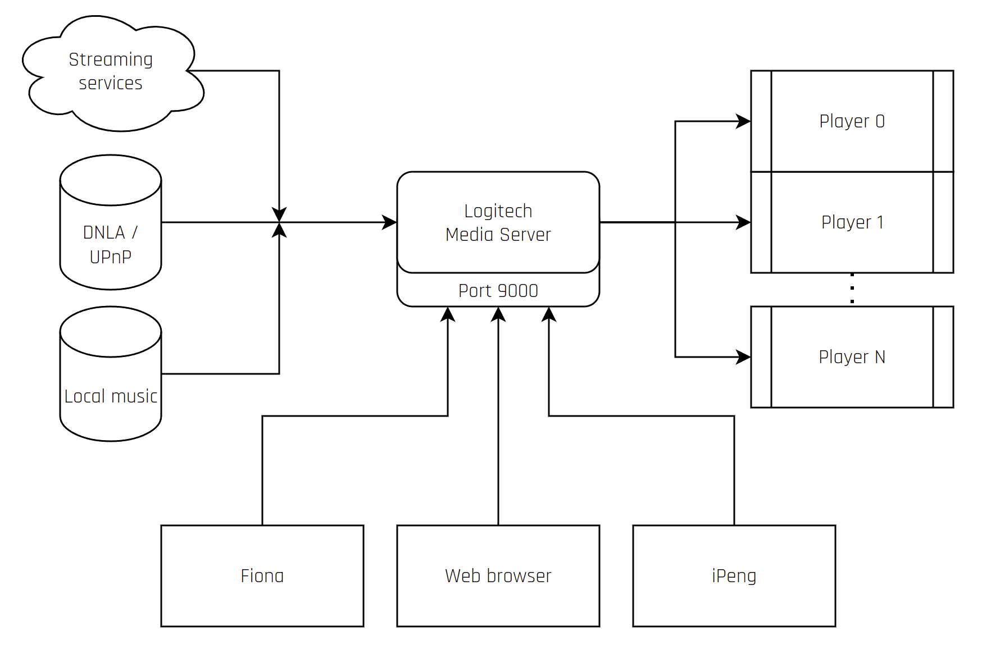
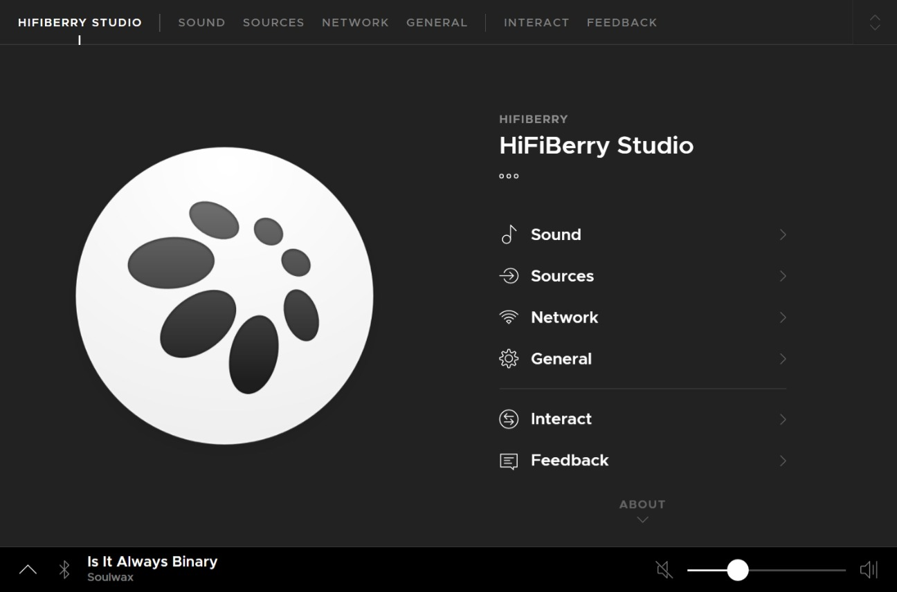
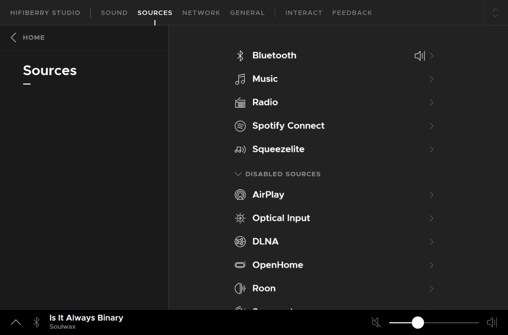
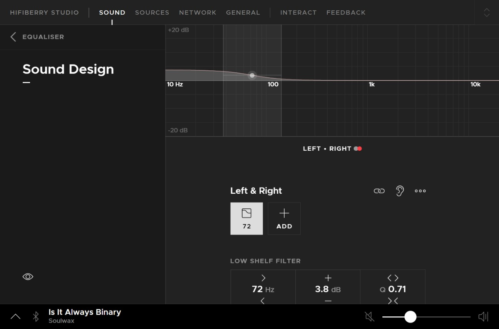

# ModulAmp - The Software

Software in ModulAmp runs on two modules: the streamer and the controller. The streamer module is based on Linux and it runs unmodified from the original distro as downloaded from the HifiBerryOS website, so there's not a lot to be said about it; you just write it on a MicroSD card, plug it in the Raspberry Pi card socket, and it runs. 

The controller firmware, on the other hand, is a complex Arduino sketch, implementing a Jeeves "thing". Jeeves is my homegrown smart home system, more about it in the future.

## Streamer

The streaming module runs a specialized Linux distro called [HifiBerryOS](https://www.hifiberry.com/hifiberryos/), based on [Buildroot](https://buildroot.org/) and developed by _Modul 9 GmbH_, a Swiss company. 

Due to the particular configuration of the enclosure, touch screen capabilities are not available, so everything needs to be controlled remotely. In my particular setup, I use the streamer as a Squeezeplay player, so I can target it with any of a number of software players that can control my LMS instance.

<figcaption>High level diagram of an LMS setup</figcaption>

Another option is to use it directly as an AirPlay, Spotify Connect, or Roon endpoint. This can all be configured via the HifiBerry web interface.

Once HifiBerryOS is installed, there is a little configuration step where you can define the player name, the network credentials (if connected via Wi-Fi) and then it's basically done. LMS will discover it as a player and everything will just work.

<figcaption>HifiBerryOS web interface home</figcaption>

<figcaption>HifiBerryOS web interface sources selection</figcaption>

<figcaption>HifiBerryOS web interface  parametric equalizer</figcaption>

## Controller

new_releases TBW

### MQTT

new_releases TBW

#### MQTT Topics

* modulamp/input
* modulamp/volume

#### Controlling ModulAmp

* modulamp/cmd volume 0..20 (0=mute)
* modulamp/cmd input 0..2 (0=Streaming, 1=Phono, 2=Aux)

