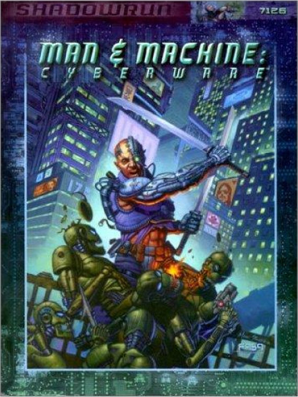
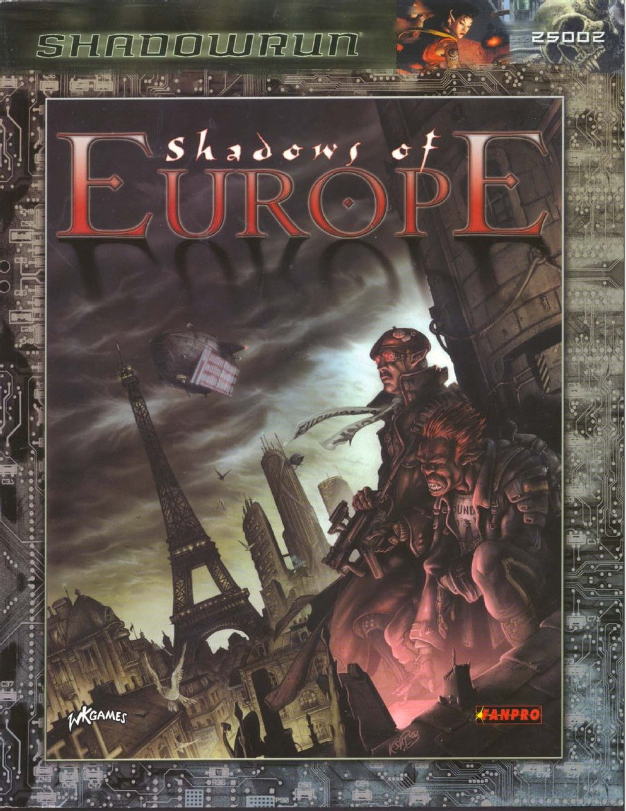
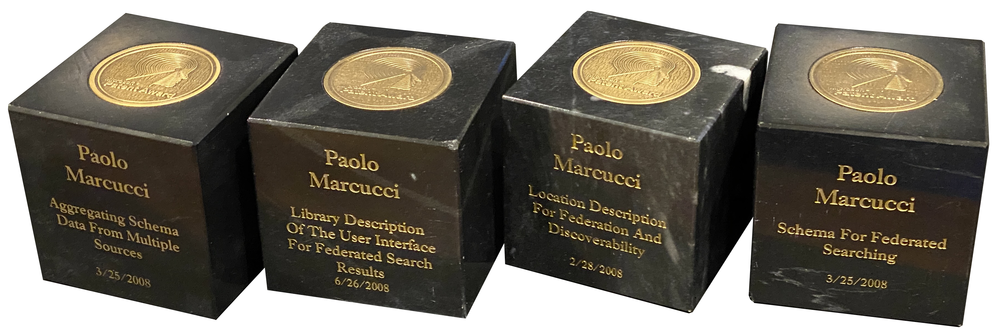

## scientific and technical publications

1.	*A. Balestra, P. MARCUCCI, R. Smareglia* 
<a href="01 - A Set of Software Drivers for the Imagen 8-300 Printer.pdf">**A Set of Software Drivers for the Imagen 8/300 Printer**</a>.  
Pubblicazione Osservatorio Astronomico di Trieste, 1990 
2.	*A. Balestra, P. MARCUCCI, M. Pucillo, P. Santin, G. Sedmak, C. Vuerli* 
<a href="02 - Remote Observing Project. Status Report n. 2.pdf">**Remote Observing Project. Status Report n. 2**</a>.  
Pubblicazione Osservatorio Astronomico di Trieste n. 1335, 1990 
3.	*A. Balestra, P. MARCUCCI, M. Pucillo, C. Vuerli* 
<a href="03 - Galileo Project. Monitor Workstation System Architecture Design Document.pdf">**Galileo Project. Monitor Workstation System Architecture Design Document**</a>.  
Pubblicazione Osservatorio Astronomico di Trieste n. 1341, October, 1990 
4.	M. Comari, P. MARCUCCI, M. Pucillo, C. Vuerli 
**The PDS Control System. Hardware Structure** 
Pubblicazione Osservatorio Astronomico di Trieste
5.	*P. MARCUCCI* 
<a href="05 - The PDS Control System. Software Structure and User Interface.pdf">**The PDS Control System. Software Structure and User Interface**</a>. 
Pubblicazione Osservatorio Astronomico di Trieste n. 1343, 1990 
6.	*A. Balestra, P. MARCUCCI, F. Pasian, M. Pucillo, R. Smareglia, C. Vuerli* 
<a href="06 - Galileo Project Workstation Software System. Architecture Design Document.pdf">**Galileo Project Workstation Software System. Architecture Design Document**</a>. 
TNG Technical Report n. 002 
Pubblicazione Osservatorio Astronomico di Trieste n. 1428, 1991 
7.	*G. Bonanno, P. Bruno, R. Cosentino, F. Bortoletto, M. D'Alessandro, D. Fantinel, A. Balestra, P. MARCUCCI* 
<a href="07 - Detector Controllers for the Galileo Telescope, a Progress Report.pdf">**Detector Controllers for the Galileo Telescope, a Progress Report**</a>  
Progress in Telescope and Instrumentation Technologies, ESO Conference and Workshop Proceedings, ESO Conference on Progress in Telescope and Instrumentation Technologies, ESO, Garching, 27-30 April 1992, edited by Marie-Helene Ulrich, p.753, Garching: European Southern Observatory (ESO), 1992 
8.	*P. MARCUCCI* 
<a href="08 - DBlib. Disk IO Handling Library, version 1.0.pdf">**DBlib. Disk I/O Handling Library, Version 1.0**</a>. 
Trieste Astronomical Observatory, Technical Report n. 001, 1992 
9.	*A. Balestra, P. Bonifacio, M. Centurion, M. Comin, M. Franchini, P. MARCUCCI, M. Nonino, F. Pasian, L. Pulone, M. Ramella, P. Santin, G. Vladilo, C. Vuerli, A. Wallander* 
<a href="09 - The ESOOAT Second Level Remote Observing Project. Final Test on ESONTT 9-11 June 1992.pdf">**The ESO/OAT Second Level Remote Observing Project. Final Test on ESO/NTT: 9-11 June 1992**</a>. 
Trieste Astronomical Observatory, Technical Report n. 002 
Pubblicazione Osservtorio Astronomico di Trieste n. 1443, 1992 
10.	*P. MARCUCCI, M. Pucillo* 
<a href="10 - The Galileo Table Editor.pdf">**The Galileo Table Editor**</a>.  
in: Galileo Project, Technical Report n. 15 
Trieste Astronomical Observatory, Technical Report n. 007 
Pubblicazione Osservtorio Astronomico di Trieste n. 1450, 1992 
11.	*P. MARCUCCI, M. Pucillo* 
**The Galileo Interactive Panel Editor.**  
in: Galileo Project, Technical Report 
Trieste Astronomical Observatory, Technical Report n. 008, 1992 
12.	*P. MARCUCCI* 
<a href="12 - The Galileo Waveform Editor.pdf">**The Galileo Waveform Editor**</a>.  
in: Galileo Project, Technical Report 
Trieste Astronomical Observatory, Technical Report n. 009, 1992 
13.	*P. MARCUCCI, M. Pucillo* 
<a href="13 - The Galileo User Interface User's Guide.pdf">**The Galileo Users Interface. Users Guide**</a>. 
in: Galileo Project, Technical Report 
Trieste Astronomical Observatory, Technical Report n. 010, 1992 
14.	*P. MARCUCCI, M. Pucillo* 
<a href="14 - The Galileo User Interface Programmer's Guide.pdf">**The Galileo User Interface. Programmers Guide**</a>. 
in: Galileo Project, Technical Report 
Trieste Astronomical Observatory, Technical Report n. 011, 1992 
15.	*P. MARCUCCI* 
<a href="15 - The Galileo Help System, version 1.0.pdf">**The Galileo Help System. Version 1.0**</a>. 
in: Galileo Project, Technical Report n. 16 
Trieste Astronomical Observatory, Technical Report n. 012, 1992 
16.	*P. MARCUCCI, F. Pasian, L. Rusconi, G. Sedmak* 
<a href="16 - Interactive Spectral Analysis under X-Windows.pdf">**Interactive Spectral Analysis under X-Windows**</a>.  
in: Proc. 4th ESO/ST-ECF Data Analysis Workshop. P.J. Grosbol, R.C.E. de Ruijsscher eds. 
ESO Conference and Workshop Proceedings n. 41, pages 105-113, 1992 
17.	*M. Pucillo, A. Balestra, P. MARCUCCI, C. Vuerli* 
<a href="17 - The TNG Control System. Workstation Control Software and User Interface (on TNG Newsletter 5, Sept. 1993).pdf">**The TNG Control System. Workstation Control Software and User Interface**</a>.  
Astronomical Observatory of Padova-Asiago. TNG Newsletter n. 5, 1993  
Publication of the Trieste Astronomical Observatory n. 1579, 1993
18.	*M. Pucillo, A. Balestra, P. MARCUCCI, C. Vuerli* 
<a href="18 - The GALILEO Project. Workstation Control Software and User Interface (on Progress in Telescope and Instrumentation Technologies, Apr. 1992).pdf">**The GALILEO Project. Workstation Software System and User Interface**</a> 
Progress in Telescope and Instrumentation Technologies, ESO Conference and Workshop Proceedings, ESO Conference on Progress in Telescope and Instrumentation Technologies, ESO, Garching, 27-30 April 1992, Garching: European Southern Observatory (ESO), 1992, edited by Marie-Helene Ulrich, p.761
18.	*A. Balestra, P. MARCUCCI, M. Pucillo, C. Vuerli* 
<a href="19 - The Galileo Ancillary Process Programmer's Guide.pdf">**The Galileo Ancillary Process Programmer's Guide**</a>.  
Publication of the Trieste Astronomical Observatory n. 1622, 1994 
19.	*G. Bono, R. Smareglia, L. Pulone, A. Balestra, C. Vuerli, C. Cumani, P. MARCUCCI, M. Pucillo, P. Santin, F. Pasian, L. Rusconi, G. Sedmak* 
<a href="20 - Optimization of Fortran Hydrocodes.pdf">**Optimization of Fortran Hydrocodes**</a>.  
Mem. S.A.It. Astronet 1993, 64,n.4, 1037-1044, 1993 
20.	*F. Bortoletto, D. Fantinel, R. Ragazzoni, C. Bonoli, M. D'Alessandro, A. Balestra, P. MARCUCCI, M. Pucillo, C. Vuerli* 
<a href="21 - Active Optics Handling Inside Galileo Telescope.pdf">**Active Optics Handling Inside Galileo Telescope**</a>.  
in: SPIE Symposium on "Astronomical Telescopes and Instrumentation for the 21st Century". Kona (Hawaii, USA). D.L. Crawford and E.R. Craine eds. 
SPIE Proceedings n. 2199, 1994 
21.	*A. Balestra, P. MARCUCCI, F. Pasian, M. Pucillo, R. Smareglia, C. Vuerli* 
<a href="22 - Using NIR tools for the interfaces to the help and archive systems at the TNG telescope.pdf">**Using NIR Tools for the Interfaces to the Help and Archive Systems at the TNG Telescope**</a>.  
Vistas Astron., 39(1), 79-87, 1995 
22.	*M. Callegari, S. Monai, P. MARCUCCI, F. Pasian, M. Pucillo, C. Vuerli* 
<a href="23 - REMOT Project - Remote Operation of Generic Observing Facilities.pdf">**REMOT Project - Remote Operation of Generic Observing Facilities**</a>.  
Publication of the Astronomical observatory of Trieste n. 1885, OAT Technical Report n.32, 1995 
23.	*M. Callegari, S. Monai, P. MARCUCCI, C. Vuerli* 
<a href="24 - REMOT Project - Experimental Setting for the Demonstration of the Teleoperation System.pdf">**REMOT Project - Experimental Setting for the Demonstration of the Teleoperation System**</a>.  
Publication of the Astronomical Observatory of Trieste n. 1886, OAT Technical Report n.33, 1995 
24.	*M. Callegari, S. Monai, P. MARCUCCI, M. Pucillo, C. Vuerli* 
<a href="25 - REMOT Project - Definition of Control Systems and Remote Systems and Remote Users - Interfaces and Adaptations.pdf">**REMOT Project - Definition of Control Systems and Remote Systems and Remote Users - Interfaces and Adaptations**</a>.  
Publication of the Astronomical Observatory of Trieste n. 1887, OAT Technical Report n. 34, 1996 
25.	*M. Callegari, P. MARCUCCI, C. Vuerli* 
<a href="26 - Astronomical Telescope Remote Operation Demonstration. System Design and Integration Report.pdf">**Astronomical Telescope Remote Operation Demonstration. System Design and Integration Report**</a> 
Publication of the Astronomical Observatory of Trieste n. 1936, OAT Technical Report n. 39, 1996
26.	*M. Callegari, P. MARCUCCI, M. Pucillo, P. Santin, C. Vuerli* 
<a href="27 - Report on Astronomic Telescope Remote Operation Demonstration Testing.pdf">**Report on Astronomic Telescope Remote Operation Demonstration Testing**</a> 
Publication of the Astronomical Observatory of Trieste n. 1937, OAT Technical Report n. 40, 1996
27.	*F. Pasian, O.Yu. Malkov, P. MARCUCCI, M. Pucillo, O.M. Smirnov, C. Vuerli* 
<a href="28 - Using astrometric catalogues and the GSC for the on-line control of instrumentation at the Galileo telescope.pdf">**Using astrometric catalogues and the GSC for the on-line control of instrumentation at the Galileo telescope**</a> 
Poster at the ADASS 97 Conference, September 14-17, 1997 - Sonthofen, Bavaria
28.	*F. Pasian, O.Yu. Malkov, P. MARCUCCI, M. Pucillo, O.M. Smirnov, C. Vuerli, S. Monai, P. Conconi, E. Molinari* 
<a href="29 - Integrating the ZGSC and PPM at the Galileo Telescope for On-line Control of Instrumentation.pdf">**Integrating the ZGSC and the PPM at the Galileo telescope for the on-line control of instrumentation**</a> 
Astronomical Data Analysis Software and Systems, R.Albrecht, R.N.Hook and H.A.Bushouse eds., Publications of the Astronomical Society of the Pacific (OAT Pub. n. 1979) Volume 7/1998, Issue 145, pg. 433-437
29.	*Vuerli, C. Bonoli, A. Balestra, A. Baruffolo, L. Corcione, D. Fantinel, D. Gardiol, P. MARCUCCI, F. Pasian, C. Pernechele, M. Pucillo, R. Smareglia* 
<a href="30 - Software integration at TNG. Active optics a practical example.pdf">**Software integration at TNG. Active optics: a practical example**</a> 
Proceedings of SPIE - Telescope Control Systems III (OAT Pub. n. 1981) Volume 3351/1998, pg. 425-439
30.	*G. Sedmak, P. MARCUCCI* 
**Design And Implementation Of Astrotech Journal, An Internet Electronic Magazine For The Italian Astronomical Society** 
Astro Tech Journal SAIt, Volume 1/1998, pg. 1-8 
32. *A. Cripps, P. MARCUCCI* 
<a href="32 - Provider Registry System - HL7 v3 Interface.pdf">**Provider Registry System - HL7 v3 Interface**</a> 
Description of HL7 v3 interface for the Provider Registry System (PRS) presented at the HL7 Canada Fall 2005 conference in Victoria, BC 

## other publications
|  |  |
| --- | --- |
|  | __Man & Machine__ – FASA Corporation, 1999 Project Editor of a supplement for the Shadowrun role playing system |
|  | __Matrix__ – FASA Corporation, 2000 Co-writer of a supplement for the Shadowrun role playing system |
|  | __Shadows of Europe__ – Fanpro, 2004 Co-writer of a supplement for the Shadowrun role playing system |

## patents

* [US8001154 - Library description of the user interface for federated search results](US8001154%20-%20Library%20description%20of%20the%20user%20interface%20for%20federated%20search%20results.pdf)
* [US8117239 - Aggregating schema data from multiple sources](US8117239%20-%20Aggregating%20schema%20data%20from%20multiple%20sources.pdf)
* [US8229963 - Schema for federated searching](US8229963%20-%20Schema%20for%20federated%20searching.pdf)
* [US8515946 - Location description for federation and discoverability](US8515946%20-%20Location%20description%20for%20federation%20and%20discoverability.pdf)